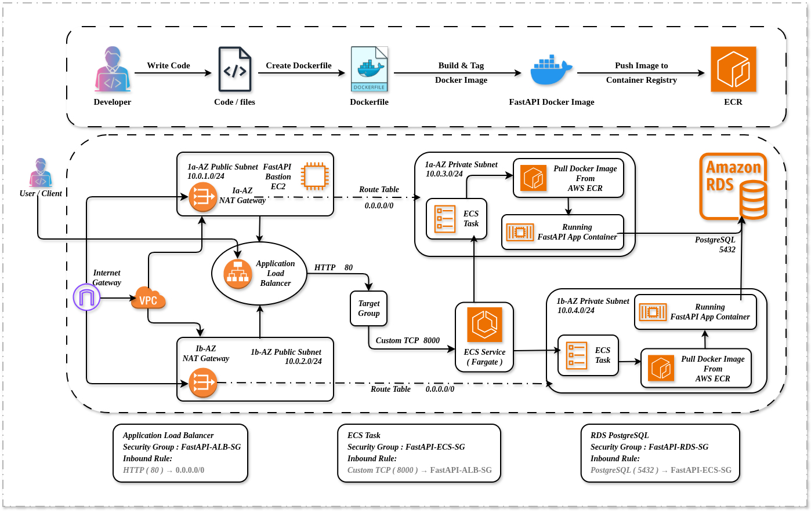

# FastAPI Project Deployment on AWS ECS Fargate with ALB, Target Group and RDS PostgreSQL

## Project Overview

This project demonstrates the deployment of a containerized FastAPI application on AWS ECS Fargate using a production-style AWS infrastructure setup.

The application is deployed behind an Application Load Balancer (ALB), uses a Target Group for routing and health checks, runs inside private subnets for better security, and connects with AWS RDS PostgreSQL database.

This project helped me learn:

* Docker containerization
* Amazon ECR
* ECS Fargate
* Application Load Balancer (ALB)
* Target Groups
* Security Groups
* Public & Private SubnetsAWS-ECS-Fargate-FastAPI-Deployment-Architecture
* ECS Services
* AWS Networking
* RDS PostgreSQL
* ECS Troubleshooting & Debugging
* Real-world DevOps deployment workflow
---

# Architecture Overview
```
Internet
↓
Application Load Balancer (Public Subnets)
↓
Target Group
↓
ECS Fargate Tasks (Private Subnets)
↓
FastAPI Container
↓
AWS RDS PostgreSQL
```
---

## 🏗️ Architecture


# AWS Services Used

| Service                         | Purpose                                 |
| ------------------------------- | --------------------------------------- |
| Amazon ECS Fargate              | Run containerized FastAPI application   |
| Amazon ECR                      | Store Docker images                     |
| Application Load Balancer (ALB) | Route incoming traffic                  |
| Target Group                    | Register ECS task IPs and health checks |
| Amazon RDS PostgreSQL           | Managed PostgreSQL database             |
| VPC                             | Isolated network environment            |
| Public Subnets                  | Used for ALB                            |
| Private Subnets                 | Used for ECS tasks                      |
| Internet Gateway                | Internet access for public subnets      |
| NAT Gateway                     | Internet access for private subnets     |
| Security Groups                 | Firewall control                        |
| Bastion Host                    | SSH access to private resources         |
| CloudWatch Logs                 | ECS application logs                    |
---

# Project Workflow
## Step 1: Build FastAPI Application

Created a FastAPI application with:

* Authentication APIs
* Category APIs
* Shop APIs
* PostgreSQL integration using SQLAlchemy
* Swagger Documentation (`/docs`)
---

## Step 2: Dockerize the Application
Created Dockerfile:

```dockerfile
FROM python:3.11-slim

ENV PYTHONDONTWRITEBYTECODE=1
ENV PYTHONUNBUFFERED=1

WORKDIR /app

RUN apt-get update && apt-get install -y \
    gcc \
    libpq-dev \
    netcat-openbsd \
    && rm -rf /var/lib/apt/lists/*

COPY requirements.txt .
RUN pip install --no-cache-dir -r requirements.txt

COPY . .

EXPOSE 8000

CMD ["uvicorn", "main:app", "--host", "0.0.0.0", "--port", "8000"]
```
---

## Step 3: Test Locally with Docker
Built and tested container locally.
```bash
docker build -t fastapi-app .
```

Run locally:
```bash
docker run -p 8000:8000 fastapi-app
```

Verified:
```bash
http://localhost:8000/docs
```
---

# Docker Compose Setup
Created `docker-compose.yml` for local development:
```yaml
version: "3.9"
services:
  api:
    build: .
    container_name: fastapi_app
    ports:
      - "8000:8000"
    env_file:
      - .env
```
---

# Step 4: Push Docker Image to Amazon ECR
Created ECR repository.
Tagged image:
```bash
docker tag fastapi-app:latest <account-id>.dkr.ecr.us-east-1.amazonaws.com/fastapi-app:latest
```

Pushed image:
```bash
docker push <account-id>.dkr.ecr.us-east-1.amazonaws.com/fastapi-app:latest
```
---

# Step 5: Create Custom VPC Architecture
Created:

* 1 VPC
* 2 Public Subnets
* 2 Private Subnets
* Internet Gateway
* 2 NAT Gateways
* Route Tables

## Public Subnets
Used for:
* Application Load Balancer
* Bastion Host

## Private Subnets
Used for:
* ECS Fargate Tasks
* RDS PostgreSQL
---

# Step 6: Create RDS PostgreSQL
Created PostgreSQL RDS instance.
Configured:
* Private subnet
* Security Group
* Database username/password
* Database name

Verified connection from Bastion Host:
```bash
psql -h <rds-endpoint> -U postgres -d postgres
```
---

# Step 7: Create ECS Cluster
Created ECS Cluster using:

* AWS Fargate
Cluster is responsible for running ECS Services and Tasks.
---

# Step 8: Create ECS Task Definition
Configured:
* ECR image URI
* Container port: 8000
* CPU and memory
* Environment variables
* awslogs for CloudWatch
Important configuration:
```text
Container Port = 8000
```
---

# Step 9: Create Target Group
Created Target Group:
* Target Type: IP
* Protocol: HTTP
* Port: 8000
* Health Check Path: /docs

Important:
```text
Target Group Port = 8000
```
---

# Step 10: Create Application Load Balancer (ALB)
Created ALB:
* Internet-facing
* Public Subnets
* Listener: HTTP 80
* Forward traffic to Target Group
---

# Step 11: Configure Security Groups
## ALB Security Group
Inbound:
| Port | Source    |
| ---- | --------- |
| 80   | 0.0.0.0/0 |

---

## ECS Private Security Group
Inbound:
| Port | Source             |
| ---- | ------------------ |
| 8000 | ALB Security Group |
---

## RDS Security Group
Inbound:
| Port | Source         |
| ---- | -------------- |
| 5432 | ECS Private SG |
---

# Step 12: Create ECS Service
Configured ECS Service:
* Launch Type: Fargate
* Desired Tasks: 1
* Private Subnets only
* Public IP: OFF
* Existing ALB
* Existing Target Group
* Existing Listener
---

# Problems & Challenges Faced

## Problem 1: Database Does Not Exist

Error:

```text
FATAL: database "fastapi-app-db" does not exist
```

### Root Cause
Incorrect database name in environment variables.

### Solution
Updated application environment variables with correct database name.

### Learning
Always verify:
* Database name
* Username
* Password
* Host
* Port
before deploying applications.
---

# Problem 2: ECS Tasks Running but Target Group Unhealthy

### Symptoms
* ECS task was running
* Application logs looked normal
* Target Group health check failed
* ALB could not route traffic
---

## Root Cause
Port mismatch issue.
Application inside container was running on:

```text
8000
```

But:
* ECS Task Definition used 80
* Security Group allowed 80
* Target Group expected 80
This caused ALB health checks to fail.
---

# Fix Applied
Aligned all ports to:

```text
8000
```
Updated:
* Dockerfile
* ECS Task Definition
* Target Group
* Security Groups
* ECS Service
---

# Problem 3: Wrong Security Group Rules
Initially:
```text
ALB -> ECS allowed only 80
```
But application used:
```text
8000
```

### Fix
Allowed:
```text
Port 8000 from ALB-SG
```
---

# Problem 4: Mixing Public and Private Subnets
Initially selected:
* Public Subnets
* Private Subnets
inside ECS Service.

### Correct Setup
ALB:
```text
Public Subnets
```

ECS Tasks:
```text
Private Subnets
```
---

# Problem 5: Public IP Enabled for ECS Tasks

Initially:
```text
Public IP = ON
```

### Correct Setup
```text
Public IP = OFF
```

Because traffic should go through:
```text
Internet -> ALB -> ECS Tasks
```
---

# Problem 6: Confusion Between ECS Task and Task Definition

## Understanding

### Task Definition
Blueprint/template.
Contains:
* Docker image
* CPU
* Memory
* Container port
* Environment variables

### Task
Actual running container created from Task Definition.

### Service
Maintains desired number of running tasks.

---

# Important Learnings

## 1. ECS Fargate Networking
ECS Fargate with `awsvpc` mode assigns:
* separate ENI
* separate private IP
for each task.
---

# 2. ECS Automatically Registers Targets
In ECS Fargate:
* ECS Service automatically registers task IPs into Target Group.
* No need to manually register targets.
---

# 3. Container Port is Very Important
The container port in:
* Docker
* ECS Task Definition
* Target Group
* Security Group
must match.
---

# 4. ALB Health Checks Are Critical
Health check configuration:
```text
Path: /docs
Port: 8000
Protocol: HTTP
```
must correctly reach the application.

---

# Final Working Flow
```
Client Request
↓
ALB (Port 80)
↓
Target Group
↓
ECS Fargate Task (Port 8000)
↓
FastAPI Application
↓
RDS PostgreSQL
```
---

# Commands Used During Debugging

## Check PostgreSQL Databases
```bash
\l
```

## Connect PostgreSQL Database
```bash
psql -h <host> -U postgres -d postgres
```

## List Tables
```bash
\dt
```

## Describe Table
```bash
\d table_name
```
---

# CloudWatch Logs Used for Debugging
Used ECS CloudWatch logs to debug:
* Database connection issues
* Port mapping problems
* Health check failures
* Application startup issues
---

# Skills Demonstrated in This Project
* AWS ECS Fargate
* Docker
* Amazon ECR
* ALB & Target Groups
* VPC Networking
* Security Groups
* FastAPI Deployment
* PostgreSQL
* CloudWatch Logs
* ECS Debugging
* Infrastructure Troubleshooting
* DevOps Concepts
---

# Final Result
Successfully deployed a production-style FastAPI application using:
* ECS Fargate
* ALB
* Target Groups
* Private Subnets
* RDS PostgreSQL
* Security Groups
* Docker & ECR
with successful troubleshooting and debugging of real-world ECS networking and health check issues.
---

# Author
**Rishabh Srivastava**

## ⭐ If you found this useful
Give this repo a ⭐ and feel free to fork!
