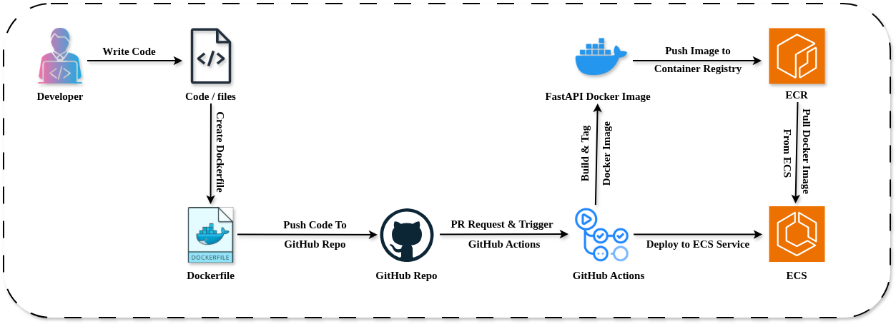

# FastAPI CI/CD Pipeline using GitHub Actions, AWS ECR, and ECS

This project demonstrates a CI/CD workflow for deploying a containerized FastAPI application using GitHub Actions, AWS ECR, and AWS ECS.

---

# Architecture Workflow

```text
Developer
   ↓
GitHub Repository
   ↓
GitHub Actions
   ├── Build Docker Image
   ├── Push Image to AWS ECR
   └── Deploy to ECS Service
                     ↓
              ECS pulls image from ECR
                     ↓
               Running Container
```
---

## 🏗️ Architecture

---

# Technologies Used

* FastAPI
* Docker
* GitHub Actions
* AWS ECR
* AWS ECS
* Git & GitHub

---

# CI/CD Workflow

## Step 1: Developer Pushes Code

Application source code and Dockerfile are pushed to the GitHub repository.

---

## Step 2: GitHub Actions Trigger

GitHub Actions workflow automatically starts on push or pull request events.

Example:

```yaml
on:
   push:
      branches: [ master ]

   pull_request:
      branches: [ master ]
```

---

## Step 3: Docker Image Build

GitHub Actions builds the Docker image for the FastAPI application.

```bash
docker build -t fastapi-app .
```

---

## Step 4: Push Docker Image to AWS ECR

The Docker image is tagged and pushed to Amazon Elastic Container Registry (ECR).

```bash
docker push <ecr-image-uri>
```

---

## Step 5: Deploy to AWS ECS

GitHub Actions updates the ECS service deployment.

ECS then:

* Pulls latest image from ECR
* Starts updated container
* Replaces old running task

---

# Project Structure

```text
.
├── .github/workflows/
│   └── deploy.yml
├── app/
├── Dockerfile
├── requirements.txt
├── main.py
└── README.md
```

---

# Learning Outcomes

This project helped in understanding:

* CI/CD pipeline implementation
* Docker containerization workflow
* GitHub Actions automation
* AWS ECS deployment process
* AWS ECR image management
* Container deployment lifecycle

---

# Author
Rishabh Srivastava
