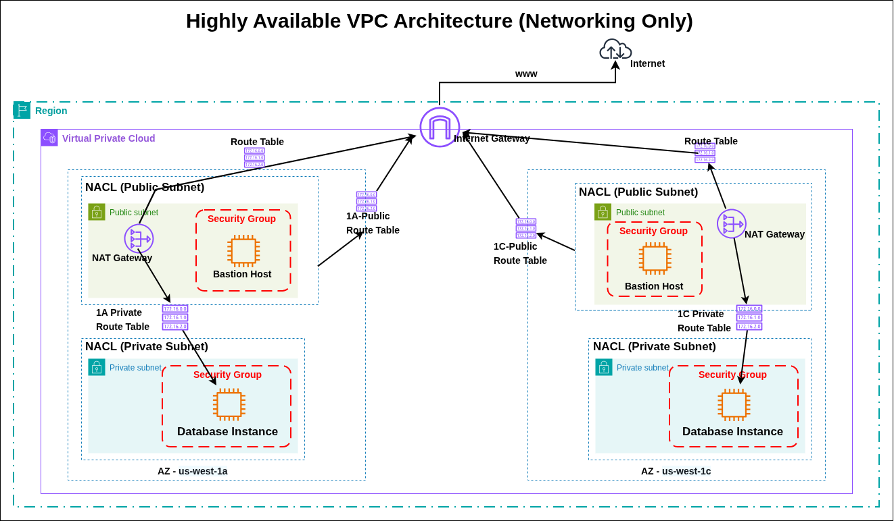

# Highly Available 3-Tier VPC Architecture (Networking Only)

## 📌 Project Overview
This project demonstrates the implementation of a **Highly Available VPC Architecture** in AWS, focusing on networking components such as VPC, Subnets, Route Tables, Internet Gateway, NAT Gateway, NACLs, and Security Groups.

The architecture is deployed across **multiple Availability Zones (AZs)** to ensure high availability and fault tolerance.
---

## 🏗️ Architecture Components

### 1. VPC
* Created a VPC named **Prod-VPC**
* CIDR Block: `10.0.0.0/16`
---

### 2. Subnets
Created **4 subnets across 2 Availability Zones**:

* **Public Subnets**
  * `10.0.1.0/24` → us-west-1a
  * `10.0.3.0/24` → us-west-1c

* **Private Subnets**
  * `10.0.2.0/24` → us-west-1a
  * `10.0.4.0/24` → us-west-1c
---

### 3. Internet Gateway (IGW)
* Created and attached an **Internet Gateway** to the VPC
* Enables internet access for public subnets
---

### 4. NAT Gateway (High Availability)
* Created **2 NAT Gateways** (one per AZ for HA)

  * NAT Gateway in **1a → Public Subnet (1a)**
  * NAT Gateway in **1c → Public Subnet (1c)**
* Allows private instances to access the internet securely
---

### 5. Route Tables
* **Public Route Table**
  * Associated with both public subnets
  * Route:
    * `0.0.0.0/0 → Internet Gateway`

* **Private Route Table (1a)**
  * Associated with private subnet (1a)
  * Route:
    * `0.0.0.0/0 → NAT Gateway (1a)`

* **Private Route Table (1c)**
  * Associated with private subnet (1c)
  * Route:
    * `0.0.0.0/0 → NAT Gateway (1c)`
---

### 6. Network ACLs (NACLs)
Created **2 NACLs**:
* **Public-NACL**
  * Associated with public subnets

* **Private-NACL**
  * Associated with private subnets

> ⚠️ Note:
> By default, NACLs are **stateless**, so both inbound and outbound rules must be explicitly allowed.
---

### 7. Security Groups
* **Public-SG (Bastion Host)**
  * Inbound:
    * SSH (Port 22) → Your IP

  * Outbound:
    * Allow All

* **Private-SG**
  * Inbound:
    * SSH (Port 22) → Source: Public-SG

  * Outbound:
    * Allow All
---

### 8. EC2 Instances
Deployed **4 EC2 instances**:
* **Public Instances (Bastion Hosts)**
  * 1 in us-west-1a
  * 1 in us-west-1c

* **Private Instances**
  * 1 in us-west-1a
  * 1 in us-west-1c
---

## 🔐 Use Case & Troubleshooting

### Step 1: SSH to Bastion Host
* Initially unable to SSH into public EC2
* **Root Cause:** NACL had no inbound/outbound rules (default DENY)

### Step 2: Fix Public NACL
* Allowed:
  * Inbound: SSH (22)
  * Outbound: All Traffic

> ✅ Result: Able to SSH into Bastion Host
---

### Step 3: SSH to Private EC2 (via Bastion)
* Encountered **Connection Timeout**
---

### 🚨 Root Cause
* Missing **Ephemeral Port Rules**
* NACL is **stateless**, so return traffic must be explicitly allowed
---

## 🔧 Final NACL Configuration
### Private NACL

#### Inbound Rules:
| Rule | Type       | Port Range | Source      |
| ---- | ---------- | ---------- | ----------- |
| 100  | SSH        | 22         | 10.0.1.0/24 |
| 110  | Custom TCP | 1024-65535 | 10.0.1.0/24 |
| 120  | SSH        | 22         | 10.0.3.0/24 |
| 130  | Custom TCP | 1024-65535 | 10.0.3.0/24 |

#### Outbound Rules:
| Rule | Type       | Port Range | Destination |
| ---- | ---------- | ---------- | ----------- |
| 100  | Custom TCP | 1024-65535 | 10.0.1.0/24 |
| 110  | SSH        | 22         | 10.0.1.0/24 |
| 120  | Custom TCP | 1024-65535 | 10.0.3.0/24 |
| 130  | SSH        | 22         | 10.0.3.0/24 |
---

### Public NACL

#### Inbound Rules:
| Rule | Type       | Port Range | Source      |
| ---- | ---------- | ---------- | ----------- |
| 100  | SSH        | 22         | 0.0.0.0/0   |
| 110  | Custom TCP | 1024-65535 | 10.0.2.0/24 |
| 120  | Custom TCP | 1024-65535 | 10.0.4.0/24 |

#### Outbound Rules:
| Rule | Type        | Destination |
| ---- | ----------- | ----------- |
| 100  | All Traffic | 0.0.0.0/0   |
---

## ✅ Final Outcome
* Successfully connected:
  * Local → Bastion Host (Public EC2)
  * Bastion Host → Private EC2

* Understood:
  * NACL vs Security Group behavior
  * Importance of **ephemeral ports**
  * High Availability networking design
---

## 📚 Key Learnings
* NACLs are stateless, Security Groups are stateful.
* Ephemeral ports are required for return traffic.
* NAT Gateway should be deployed per AZ for HA.
* Route Tables must align with subnet design.
* Bastion Host is required for accessing private resources.
---

## 📷 Architecture Diagram

## 🧑‍💻 Author
**Rishabh Srivastava**
---

## ⭐ If you found this useful
Give this repo a ⭐ and feel free to fork!
