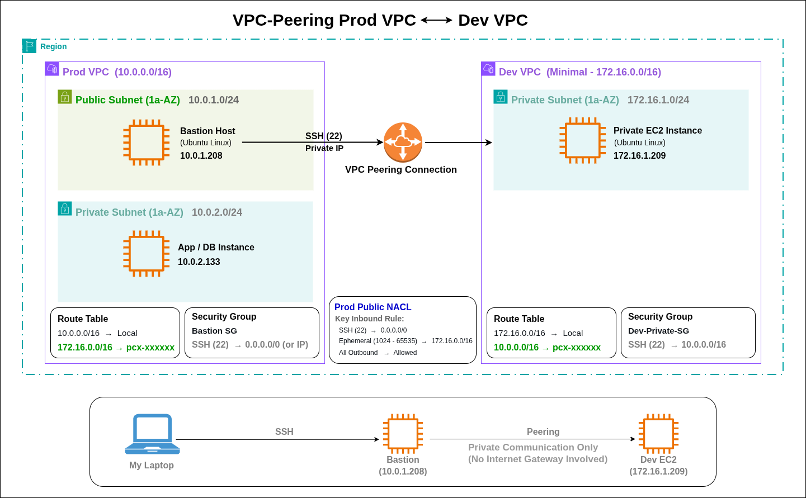

# VPC Peering Implementation (Prod VPC ↔ Dev VPC)

## 📌 Project Overview
This project demonstrates the implementation of **VPC Peering** between two Virtual Private Clouds (VPCs) in AWS to enable **private communication across VPCs**.

The goal was to:
* Connect two isolated VPCs.
* Enable SSH access from **Prod Bastion Host → Dev Private EC2**.
* Understand real-world networking concepts like routing, security groups, and troubleshooting connectivity issues.
---

## 🏗️ Architecture Summary

### 🔹 Prod VPC
* CIDR: `10.0.0.0/16`
* Subnets:
  * Public: `10.0.1.0/24`, `10.0.3.0/24` (Bastion Host)
  * Private: `10.0.2.0/24`, `10.0.4.0/24`
* Internet Gateway attached
* NAT Gateway configured (for private subnets)
* Bastion Host deployed in public subnet
---

### 🔹 Dev VPC (Minimal Setup)
* CIDR: `172.16.0.0/16`
* Subnets:
  * Private: `172.16.1.0/24`
* No Internet Gateway / NAT Gateway (not required)
* 1 EC2 instance deployed in private subnet
---

## 🔗 VPC Peering Setup
* Created **VPC Peering Connection**
  * Requester: Prod VPC
  * Accepter: Dev VPC
* Status: **Active**
---

## 🛣️ Route Table Configuration

### 🔹 Prod VPC Route Tables
Added route in:
* Public Route Table
* Private Route Tables
```text
Destination: 172.16.0.0/16
Target: VPC Peering Connection (pcx-xxxx)
```
---

### 🔹 Dev VPC Route Table
```text
Destination: 10.0.0.0/16
Target: VPC Peering Connection (pcx-xxxx)
```
---

## 🔐 Security Group Configuration

### Dev Private EC2 Security Group
Inbound:
```text
Type: SSH
Port: 22
Source: 10.0.0.0/16
```

Outbound:
```text
Allow All Traffic
```
---

## 🔄 Connectivity Flow
```text
Local Machine
   ↓
Bastion Host (Prod VPC - Public Subnet)
   ↓
Private EC2 (Dev VPC via VPC Peering)
```
---

## 🧪 Testing
From Bastion Host:
```bash
ssh -i Dev-Private-KP.pem ubuntu@172.16.1.209
```
---

## ❌ Issue Faced

### Problem:
Unable to SSH into Dev Private EC2
```bash
Connection timed out
```
---

## 🔍 Root Cause Analysis

Even though:
* VPC Peering was active ✅
* Route tables were correctly configured ✅
* Security Groups were correctly configured ✅

The connection was still failing.

### Root Cause:
👉 **Network ACL (NACL) in Prod Public Subnet was blocking return traffic**
* NACL is **stateless**
* It requires explicit allow rules for both:
  * Incoming request
  * Outgoing response (ephemeral ports)
---

## 🔧 Solution

### Fix Applied in Prod-Public-NACL
Added rule:
```text
Type: Custom TCP
Port Range: 1024–65535
Source: 172.16.0.0/16
Action: Allow
```
---

### Why This Works
SSH connection flow:
```text
Bastion → Dev EC2 (Port 22)
Dev EC2 → Bastion (Ephemeral Ports 1024–65535)
```
👉 Without allowing ephemeral ports, return traffic was blocked → timeout
---

## ✅ Final Result
* Successfully connected:
  * Bastion → Dev Private EC2
* Installed packages:
  * `apache2`
  * System updates
* Verified cross-VPC communication via private IP
---

## 📚 Key Learnings
  * VPC Peering connects entire VPCs using private IPs
  * Route tables must be configured in **both VPCs**
  * Security Groups are **stateful**
  * NACLs are **stateless**
  * Ephemeral ports are critical for return traffic
  * Minimal setup is sufficient for testing peering
---

## 📷 Architecture Diagram


## 🧑‍💻 Author
**Rishabh Srivastava**
---

## ⭐ If you found this useful
Give this repo a ⭐ and feel free to fork!
